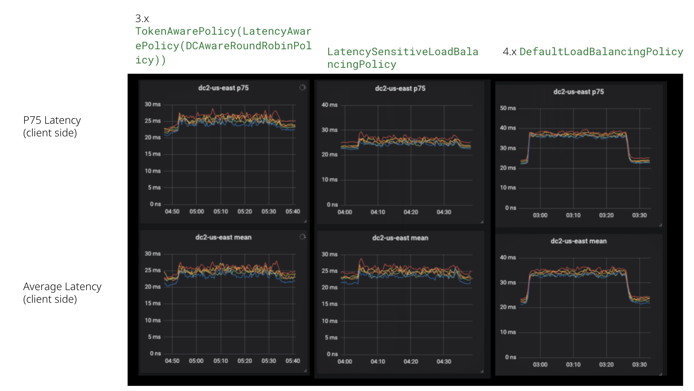
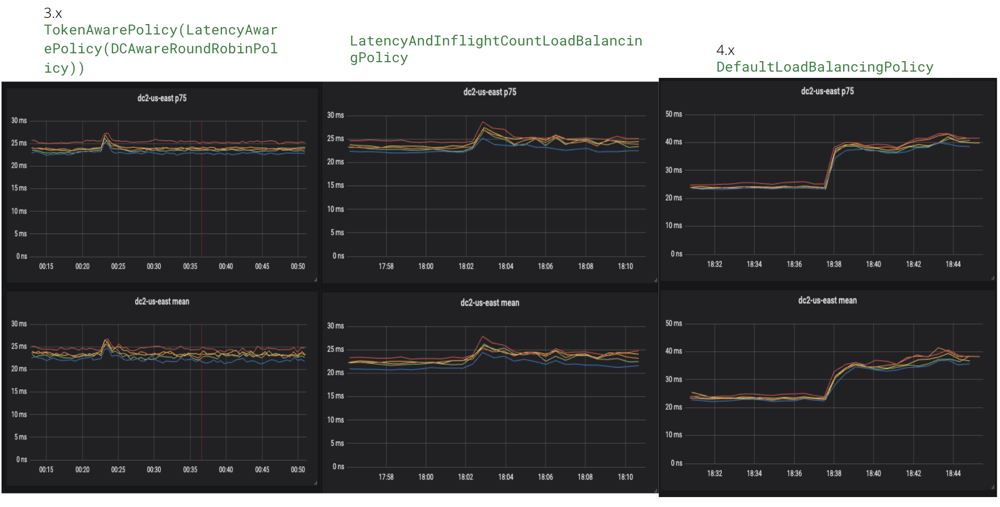
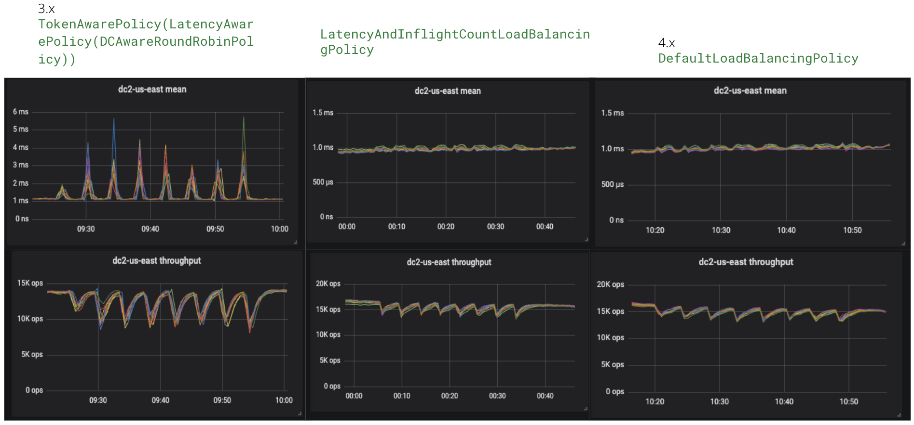

# Supplementary Policies for Apache Cassandra Java Driver
Currently, this package contains two load balancing policies to be used with the [Apache Cassandra Java Driver](https://github.com/apache/cassandra-java-driver) (version 4.10.0+) - `LatencyAndInflightCountLoadBalancingPolicy` and `LatencySensitiveLoadBalancingPolicy`.

## Get Started
To use either of the policies, you need to include both the Java driver and this package as dependencies.
```xml
        <dependency>
            <groupId>org.apache.oss</groupId>
            <artifactId>java-driver-core</artifactId>
            <version>4.10.0</version>
        </dependency>
        <dependency>
            <groupId>com.datastax.oss</groupId>
            <artifactId>java-driver-policies</artifactId>
            <version>1.0</version>
        </dependency>
```

You also have to specify the name of the load balancing policy class in your `application.conf` (see [this](https://docs.datastax.com/en/developer/java-driver/4.17/manual/core/load_balancing/index.html#load-balancing)).
```conf
datastax-java-driver.basic.load-balancing-policy {
  class = LatencySensitiveLoadBalancingPolicy
}
```

## How to Choose a Load Balancing Policy
We recommend the `DefaultLoadBalancingPolicy` that comes with the Java Driver for general use. 
This policy leverages real-time measurements and swiftly responds to changes in node status at short intervals, such as those caused by garbage collection or compaction—common factors that can slow down nodes. 

However, if you anticipate prolonged delays in node responsiveness, such as during network upgrades or heavy data migrations, you might consider opting for the `LatencyAndInflightCountLoadBalancingPolicy` or `LatencySensitiveLoadBalancingPolicy`.

`LatencySensitiveLoadBalancingPolicy` behaves the closest to the 3.x java driver's `TokenAwarePolicy(LatencyAwarePolicy(DCAwareRoundRobinPolicy))`. 
They have an advantage over 4.x `DefaultLoadBalancingPolicy` when nodes are slowed for a long time, because they both depend on historical data. 
Below is the p75 and mean client side latencies of the 3.x driver, `LatencySensitiveLoadBalancingPolicy`, and 4.x driver, for a cluster when one replica for each request is slowed down for 30 minutes.



`LatencyAndInflightCountLoadBalancingPolicy` also has such an advantage in the 30-minute scenario. See the following chart.



However, both `LatencyAndInflightCountLoadBalancingPolicy` and 4.x `DefaultLoadBalancingPolicy` have a significant advantage when nodes are slowed for a short time, because they use real-time measurements, specifically count of in-flight requests.
Below is the client-side latency and the throughput of the 3.x driver, `LatencyAndInflightCountLoadBalancingPolicy`, and 4.x driver, for a cluster when one replica for each request is toggling being slowed every 2 minutes.



We can see both `LatencyAndInflightCountLoadBalancingPolicy` and 4.x `DefaultLoadBalancingPolicy`'s client-side latency almost doesn't change, while the 3.x driver's latency raises significantly.

Because changes in node status at short intervals, such as garbage collection, are common in the production environment.
Therefore, we recommend using the 4.x `DefaultLoadBalancingPolicy` or `LatencyAndInflightCountLoadBalancingPolicy` for general use, and `LatencySensitiveLoadBalancingPolicy` when you anticipate prolonged delays in node responsiveness.
